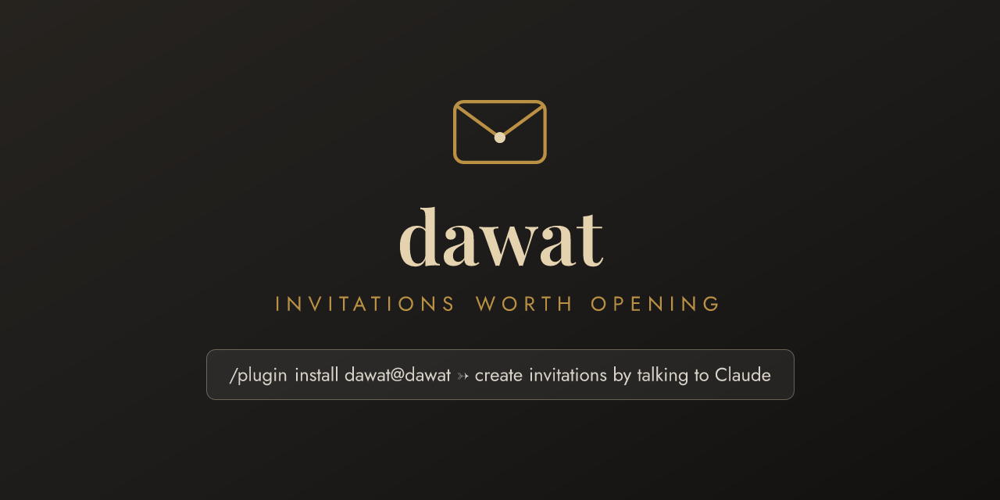
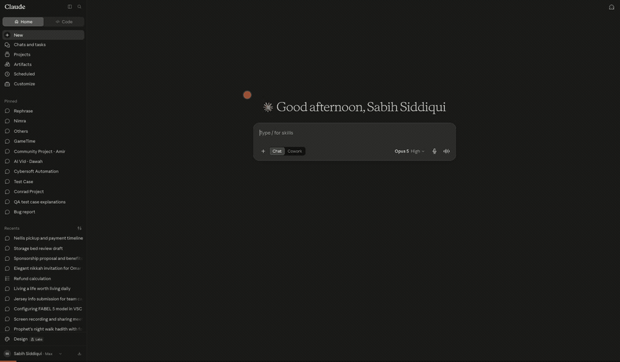

# Dawat — invitations by conversation



Create beautiful digital invitations without leaving Claude: elegant
envelope-reveal **cards** for weddings and nikkahs, vibrant **party pages** for
everything casual — plus guest lists with personalized links, email sending,
reminders, and live RSVP tracking. Powered by [dawat.events](https://dawat.events).

## See it work

One sentence in, a live invitation out — envelope, wax seal and all:



*Real run: "Create an elegant nikkah invitation for Omar & Khadija on September 12
at The Courtyard, Houston. Publish it and give me the link." →
[dawat.events/i/rB96HeUW](https://dawat.events/i/rB96HeUW)*

## Install (Claude Code)

```
/plugin marketplace add D10100111001/dawat-plugin
/plugin install dawat@dawat
```

On first use you'll be asked to connect your Dawat account (free — sign in with
Google or an email link).

## Try it

- "Create an elegant nikkah invitation for Omar & Khadija, Sept 12 at 6:30pm,
  The Courtyard Houston, dinner to follow — give me the link."
- "Make a fun party page for game night Friday 7:30 at my place."
- "Import my Paperless Post invite <link> and add my guest list."
- "Who hasn't RSVP'd yet? Send them a warm reminder."

## Using Claude (web/desktop) instead?

Add a custom connector pointing at `https://dawat.events/mcp`
(Settings → Connectors → Add custom connector).

## Links

[dawat.events](https://dawat.events) · [Privacy](https://dawat.events/privacy) · [Terms](https://dawat.events/terms) · [llms.txt](https://dawat.events/llms.txt)

## ChatGPT and Codex plugin package

The portable `plugin.json` and `mcp.json` package uses the existing OAuth-protected
Dawat server at `https://dawat.events/mcp`. It includes an invitation workflow
skill and five positive / three negative review scenarios. The Claude package
remains available through its existing installation instructions.

Build the public upload ZIP from an explicit allowlist: `plugin.json`, `mcp.json`,
`skills/dawat-invitations/SKILL.md`, and `assets/dawat-logo-300.png`. Include no
credentials, local files, or Git metadata. The five positive and three negative
cases were executed through ChatGPT with a dedicated sample account on October
1, 2026. The manifest links the public review walkthrough. Private reviewer
credentials belong in the portal's review fields, outside this package.

Public directory publication is separate from packaging. The OpenAI dashboard
requires a verified developer identity, domain challenge, tool scan, review
account, accessible video walkthrough, and approval before publishing.
See [current submission documentation](https://developers.openai.com/plugins/deploy/submission).
